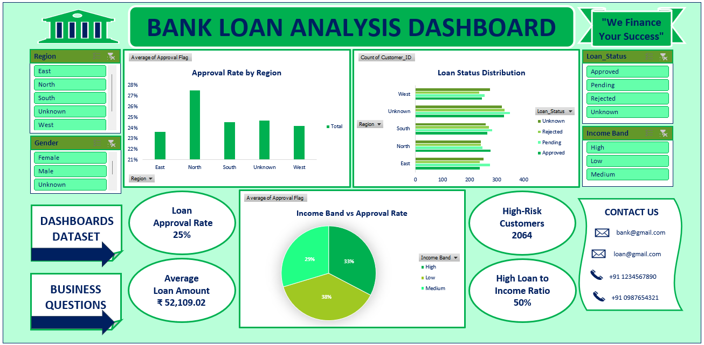

# 📊 Bank Customer Loan Tracker (Excel Dashboard)

## 📌 Project Overview
This project is an **Excel-based Loan Tracking Dashboard** developed for the **Banking & Financial Services domain**.  
It enables tracking of customer loans, monitoring repayment status, identifying overdue accounts, and supporting effective financial decision-making.

---

## 🎯 Objectives
- Track **customer loan details and repayment status**
- Identify **overdue and defaulted loans**
- Monitor **loan distribution by type**
- Analyze **outstanding balances and repayment trends**
- Build an **interactive dashboard for better insights**

---

## 🛠️ Tools & Skills Used
- Microsoft Excel  
- Data Cleaning & Transformation  
- Pivot Tables & Pivot Charts  
- Conditional Formatting  
- Excel Formulas (IF, COUNTIF, SUM, XLOOKUP, etc.)  
- Dashboard Design & KPI Metrics  

---

## 📂 Dataset Description
The dataset includes:
- **Customer ID / Name** → Customer details  
- **Loan ID** → Unique loan identifier  
- **Loan Type** → Personal, Home, Car, etc.  
- **Loan Amount (₹)** → Total loan amount  
- **Outstanding Balance (₹)** → Remaining amount  
- **Interest Rate (%)** → Applied interest rate  
- **EMI Amount (₹)** → Monthly installment  
- **Due Date** → Payment deadline  
- **Loan Status** → Active / Closed / Defaulted  

---

## 🔄 Data Processing Steps
- Removed duplicate records using **Loan ID**
- Cleaned and standardized text fields
- Handled missing values using appropriate replacements
- Converted numeric columns into proper format
- Created calculated columns:
  - **Total Paid (₹)** = Loan Amount – Outstanding Balance  
  - **Overdue Status** = On Time / Overdue / Defaulted  
  - **Payment Flag** to track missed EMIs  

---

## 📊 Dashboard Features
- 📌 **Total Loan Amount (₹)**
- 📌 **Total Outstanding Balance (₹)**
- 📌 **Overdue & Default Loan Indicators**
- 📌 **Loan Type Distribution (Pie Chart)**
- 📌 **Outstanding Balance Analysis (Bar Chart)**
- 📌 **Repayment Trend (Line Chart)**
- 📌 **Interactive Filters using Slicers**

---

## 📈 Key Insights
- Identified **high-risk customers with overdue loans**
- Highlighted **loan types with highest outstanding balances**
- Tracked **repayment behavior over time**
- Helped in reducing **default risk through monitoring**
- Improved financial decision-making with clear insights

---

## 🖼️ Dashboard Preview

---

## 🚀 How to Use
1. Download the Excel file  
2. Open in Microsoft Excel  
3. Click **Data → Refresh All**  
4. Use slicers to interact with the dashboard  

---

## 📁 Files Included
- `Bank Customer Loan Tracker.xlsx`  
- `README.md`  
- `screenshot.png`  

---

## 💡 Future Enhancements
- Power BI version of dashboard  
- Automated EMI reminder system  
- Loan default prediction model  
- Customer risk segmentation  

---

## 👩‍💻 Author
**Tejshree**  
🔗 Email: *official.tejshree01@gmail.com*  
🔗 LinkedIn: https://www.linkedin.com/in/tejshree-t  
🔗 GitHub: https://github.com/officialtejshree01-lgtm  

---

## ⭐ Support
If you like this project, give it a ⭐ on GitHub!
