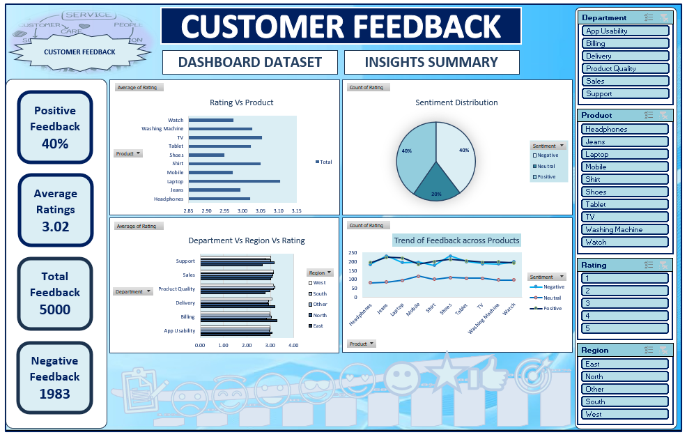

# 📊 Customer Feedback Analysis (Excel Dashboard)

## 📌 Project Overview
This project is an **Excel-based Customer Feedback Analysis Dashboard** developed for the **Customer Experience / Service Quality domain**.  
It helps organizations analyze customer feedback, identify satisfaction trends, and improve overall service quality through data-driven insights.

---

## 🎯 Objectives
- Analyze **customer feedback data** effectively  
- Measure **customer satisfaction levels**  
- Identify **common issues and complaint areas**  
- Track **feedback trends over time**  
- Provide actionable insights to improve **customer experience**

---

## 🛠️ Tools & Skills Used
- Microsoft Excel  
- Data Cleaning & Transformation  
- Pivot Tables & Pivot Charts  
- Conditional Formatting  
- Excel Functions (IF, COUNTIF, AVERAGE, XLOOKUP, etc.)  
- Dashboard Design & Data Visualization  

---

## 📂 Dataset Description
The dataset includes:
- **Customer ID** → Unique customer identifier  
- **Feedback ID** → Unique feedback entry  
- **Feedback Date** → Date of submission  
- **Rating (1–5)** → Customer satisfaction score  
- **Feedback Category** → Service, Product, Support, etc.  
- **Comments** → Customer remarks  
- **Response Status** → Resolved / Pending  
- **Region / Location** → Customer location  

---

## 🔄 Data Processing Steps
- Removed duplicate entries using **Feedback ID**  
- Cleaned and standardized text fields  
- Handled missing values appropriately  
- Converted ratings into numeric format  
- Created calculated fields:
  - **Satisfaction Level** (Low / Medium / High)  
  - **Response Flag** (Resolved vs Pending)  
  - **Average Rating KPI**  

---

## 📊 Dashboard Features
- 📌 **Average Customer Rating**  
- 📌 **Total Feedback Count**  
- 📌 **Resolved vs Pending Cases**  
- 📌 **Feedback Category Distribution (Pie Chart)**  
- 📌 **Rating Analysis (Bar Chart)**  
- 📌 **Trend Analysis Over Time (Line Chart)**  
- 📌 **Interactive Filters using Slicers**  

---

## 📈 Key Insights
- Identified **areas with low customer satisfaction**  
- Highlighted **categories with the highest complaints**  
- Tracked **improvement trends in service quality**  
- Detected **pending responses requiring attention**  
- Enabled better decision-making for **customer experience improvement**  

---

## 🖼️ Dashboard Preview

> 📌 Upload your dashboard screenshot in the repository and name it `screenshot.png`

---

## 🚀 How to Use
1. Download the Excel file  
2. Open in Microsoft Excel  
3. Go to **Data → Refresh All**  
4. Use slicers to explore insights interactively  

---

## 📁 Files Included
- `Customer Feedback Analysis.xlsx`  
- `README.md`  
- `screenshot.png`  

---

## 💡 Future Enhancements
- Power BI dashboard version  
- Sentiment analysis on customer comments  
- Automated feedback classification  
- Real-time feedback tracking system  

---

## 👩‍💻 Author
**Tejshree**  
🔗 LinkedIn: https://www.linkedin.com/in/tejshree-t  
🔗 GitHub: https://github.com/officialtejshree01-lgtm  

---

## ⭐ Support
If you like this project, consider giving it a ⭐ on GitHub!
