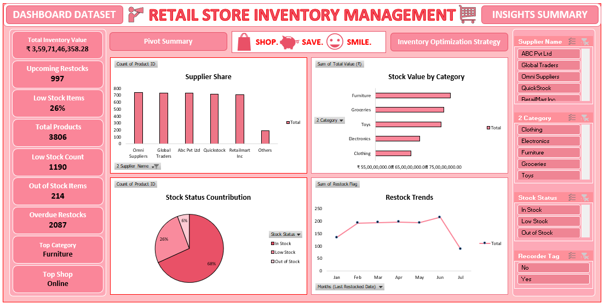

# 📦 Retail Store Inventory Management (Excel Dashboard)

## 📌 Project Overview
This project is an **Excel-based Inventory Management Dashboard** developed for a **Banking & Financial Services company** to manage and monitor retail inventory efficiently.  

It enables tracking of stock levels, identification of low-stock items, and analysis of inventory value to support better operational decisions.

---

## 🎯 Objectives
- Track **inventory levels across products and stores**
- Identify **low stock and out-of-stock items**
- Monitor **category-wise stock value**
- Analyze **supplier-wise inventory contribution**
- Enable **efficient and timely restocking decisions**

---

## 🛠️ Tools & Skills Used
- Microsoft Excel  
- Data Cleaning & Transformation  
- Pivot Tables & Charts  
- Conditional Formatting  
- Excel Formulas (IF, COUNTIF, SUM, XLOOKUP)  
- Dashboard Design & KPI Metrics  

---

## 📂 Dataset Description
The dataset contains:
- **Product Information** → Product Name, Category  
- **Inventory Details** → Quantity in Stock, Reorder Level  
- **Supplier Information** → Supplier Name  
- **Store Locations** → Inventory distribution across stores  
- **Cost Details** → Unit Cost and Total Value  

---

## 🔄 Data Processing Steps
- Removed duplicates using **Product ID**
- Cleaned Product Name, Category, and Supplier fields
- Handled missing values (replaced with "Unknown")
- Converted numeric columns into proper format
- Created calculated fields:
  - **Total Value (₹)** = Quantity × Unit Cost  
  - **Stock Status** (Low Stock / In Stock)  
  - **Reorder Flag**  

---

## 📊 Dashboard Features
- 📌 **Total Inventory Value (₹)**
- 📌 **Low Stock & Out-of-Stock Alerts**
- 📌 **Category-wise Stock Value Analysis**
- 📌 **Supplier-wise Contribution**
- 📌 **Top Store by Inventory Value**
- 📌 **Interactive Slicers for filtering**

---

## 📈 Key Insights
- Identified products requiring **urgent restocking**
- Highlighted categories contributing the most to inventory value
- Evaluated supplier performance based on inventory share
- Detected store locations with highest stock value

---

## 🖼️ Dashboard Preview

---

## 🚀 How to Use
1. Download the Excel file  
2. Open it in Microsoft Excel  
3. Click **Data → Refresh All**  
4. Use slicers to explore insights dynamically  

---

## 📁 Files Included
- `Retail Store Inventory Management.xlsx`  
- `README.md`  
- `screenshot.png`  

---

## 💡 Future Enhancements
- Power BI dashboard version  
- Automated restock alerts  
- Inventory demand forecasting  
- Integration with real-time data sources  

---

## 👩‍💻 Author
**Tejshree**

---

## ⭐ Support
If you like this project, give it a ⭐ on GitHub!
