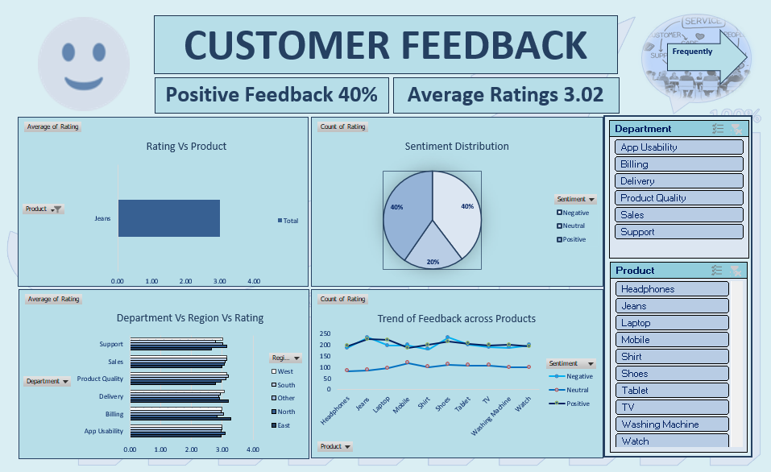

# 📊 Customer Feedback Analysis (Excel Project)

## 📌 Project Overview  
This project analyzes customer feedback data for a service-based company using Microsoft Excel. The aim is to uncover insights that improve customer satisfaction and support better business decisions.

---

## 🎯 Objectives  
- Understand customer satisfaction levels  
- Analyze feedback ratings and sentiments  
- Identify low-performing service areas  
- Enable data-driven improvements  

---

## 🛠️ Tools & Techniques Used  
- Microsoft Excel  
- Pivot Tables  
- Charts (Bar, Pie, Line)  
- Conditional Formatting  
- What-If Analysis  
- Data Cleaning  

---

## 📂 Dataset  
The dataset includes:  
- Customer ID / Name  
- Feedback Rating  
- Department (Support, Sales, Delivery, etc.)  
- Product (Mobile, Laptop, etc.)  
- Region  
- Sentiment (Positive, Neutral, Negative)  
- Date  

---

## 📊 Dashboard Screenshot  

---

## 📈 Key Insights  
- Positive feedback rate: **40%**  
- Average rating: **3.02**  
- Identified lowest-rated departments  
- Compared product-wise performance  
- Analyzed sentiment distribution  
- Tracked feedback trends over time  

---

## 🚀 How to Use  
1. Download the Excel file  
2. Open in Microsoft Excel  
3. Navigate to the Dashboard sheet  
4. Use slicers (Department, Product) to filter data  
5. Explore charts and insights  

---

## 📌 Features  
- Interactive Dashboard  
- Dynamic Filters (Slicers)  
- Multi-level Analysis (Product, Region, Department)  
- Visual Insights using Charts  

---

## 📁 Project Structure  
Services/
│── Customer Feedback Analysis.xlsx
│── dashboard.png
│── README.md

---

## 🙋‍♀️ Author  
**Tejshree**  
- Aspiring MIS / Data Analyst  

---

## ⭐ Feedback  
If you found this project useful, please ⭐ the repository and share your feedback!

